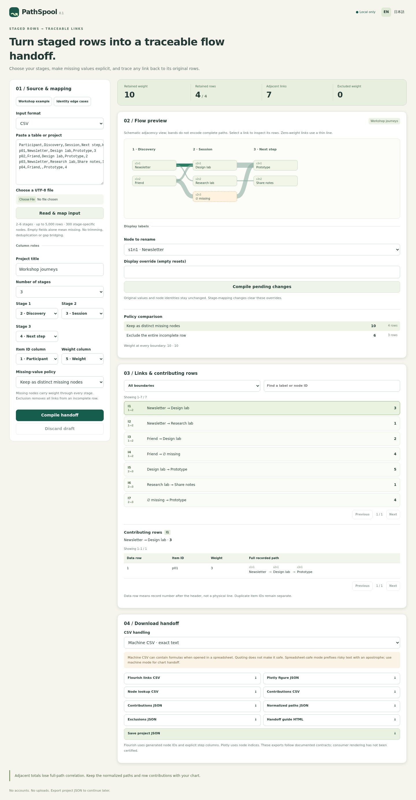

# PathSpool

**Turn staged rows into a traceable Sankey / alluvial handoff.**

PathSpool is a small local web app for people preparing a table for a flow-chart tool. Choose ordered stage columns, decide what an empty field means, and inspect the original rows behind any adjacent link. Download the chart handoff together with its evidence.

The included workshop example makes the policy consequence visible: keeping a distinct missing node retains weight **10** at both boundaries; excluding incomplete rows retains **6** and records the removed weight **4**.

## Verified preview



[Hosted verification](https://github.com/Masanori-Spec/path-spool/actions/runs/37182530119) passed for `e2059584c53ec28006211fc27ed7666318d9789e`: 141 tests in each of four Node/timezone combinations, all 19 browser scenarios, and five bounded Plotly consumer fixtures. [Screenshots, actual exports and limits](docs/verification.md).

## What it does

- CSV / TSV / versioned project JSON input, processed in the browser
- Two to six ordered stages, optional item ID and integer weight columns
- Stage-specific identity: the same label in different stages is a different node
- Editable display labels bound to original stage/value identities; duplicate display text never merges nodes
- Exact labels: no trimming, case folding, Unicode normalization, deduplication or gap bridging
- Two explicit missing policies: a separate typed missing node, or exclusion of the entire incomplete row
- Link selection, boundary/search filters, paged contributing rows and complete recorded paths
- English / Japanese interface, responsive controls and a keyboard-operable schematic preview
- Nine deterministic downloads, including a standalone printable handoff guide

No account, network requests, analytics, automatic storage, chart publication or runtime dependencies. Save project JSON before leaving if you want to resume.

## Run

Requires Node.js 22+; local model checks also use Python 3 with only the standard library.

```sh
npm run build
npm run serve
```

Open `http://127.0.0.1:4173/`. The server binds only to loopback. Serving the built files is required for ES modules; opening `index.html` directly as a file is not the supported workflow.

```sh
npm run check       # syntax/network guard, all model/state/export tests, build
npm run package     # reproducible source/static ZIPs and SHA-256 manifest
```

Browser development checks use the pinned official `plotly.js-dist-min@3.1.0` package only for synthetic consumer tests, alongside Playwright. Neither package enters the runtime build. Checks use `npm ci --ignore-scripts`, `npx playwright install --with-deps chromium`, then `npm run test:browser` with the local server running. Chromium launches with its sandbox enabled. The GitHub Actions workflow tests Node 22/24 in UTC/Tokyo and performs browser checks on Ubuntu 22.04. Do not weaken the sandbox to run in a restricted environment.

## Workflow

1. Start with the workshop example or paste/upload UTF-8 CSV, TSV or project JSON
2. Select the matching input format and choose **Read & map input**
3. For a new table, assign each ordered stage, the optional item ID, and the optional weight column; CSV/TSV reading does not infer these roles
4. Choose a missing policy and compile; old results remain visible while drafts are being edited, and exports stay locked
5. Select a link and check its contributing rows and full paths
6. Export the machine handoff plus paths, contributions, exclusions and guide; save the project JSON for resuming

Changing a label can change generated node IDs. IDs are deterministic for the same input order, mapping and policy; they are not persistent cross-project identifiers.

## Downloads

| File | Purpose |
| --- | --- |
| `flourish-machine.csv` | Generated Source/Target IDs, exact Value, numeric Step from/Step to, raw label lookup columns and missing flags |
| `plotly-figure.json` | Figure `data` / `layout`, zero-based node indices, escaped display labels and raw customdata |
| `nodes-machine.csv` | Node IDs, indices, stages, exact labels, missing flags and display overrides |
| `contributions-machine.csv` | Link-to-data-row weights and item ID presence |
| `contributions.json` | Typed link-to-row evidence |
| `paths.json` | Every retained data row's complete ordered node sequence and node lookup |
| `exclusions.json` | Removed data row numbers, weights and missing stage positions |
| `handoff-guide.html` | Standalone printable instructions, limitations, boundary totals and node lookup |
| `pathspool-project.json` | Complete source table, mapping, policy and title for exact reimport |

Spreadsheet-safe mode changes the three CSV filenames to `*-spreadsheet.csv` and prefixes formula-like text with an apostrophe. It intentionally changes those strings. JSON and the guide remain identical. **CSV quoting alone does not prevent spreadsheet formula execution.** Spreadsheet handling varies; import exact machine CSV as text with a trusted tool. Use machine mode for chart handoff.

### Consumer contracts and limits

Flourish's documented alluvial format binds Source, Target, Value, Step from and Step to. PathSpool exports generated alphanumeric IDs because the documented template can normalize labels. Bind the ID columns; raw label columns are lookups, not identity bindings. The initial chart displays IDs. Any display-label customization needs a separate check.

Plotly source/target arrays index `node.label`. Labels are ID-prefixed and escaped for Plotly text display; `node.customdata` retains raw labels and the typed missing flag. Metadata is in `layout.meta`.

**Flourish remains a documented-schema handoff; no live account import has been tested.** Five synthetic exported figures were rendered and inspected with the official Plotly.js **3.1.0** package. The sample and hostile/display-override cases rendered their positive links; mixed-zero input rendered only its positive link; all-zero and all-excluded input produced no visible bands. All five passed schema checks and retained raw metadata. This is bounded version/fixture evidence, not a general compatibility guarantee. Empty retained sets and zero-valued links remain valid evidence even when not visible. The app's own preview is a schematic adjacency view, not a complete alluvial layout engine.

An adjacent-link graph cannot preserve all full-path correlations. Two different sets of complete paths can have identical adjacent totals. Keep `paths.json` and the contribution evidence alongside a chart. No causal, statistical, legal or accessibility certification is implied.

## Input contract

- 1–5,000 data records after one header record; 2–8 source columns; 2–6 distinct ordered stage columns
- Optional item ID and weight columns must each have a separate role; unused columns remain in the project
- Maximum 300 stage-specific node identities, counting all source rows and missing nodes even under exclusion
- Maximum 160 UTF-16 code units per table field; title 1–120; header names nonempty and exactly distinct
- Missing means the exact empty string only; ` `, `0`, `null` and `(missing)` are ordinary labels
- Weight syntax is ASCII decimal digits only, with zero and leading zeroes accepted; no signs, decimals, exponents or padding
- Total input weight must not exceed 9,007,199,254,740,991; validation includes excluded rows, so every exported numeric total remains exactly representable
- Repeated item IDs and repeated rows remain separate records; missing item IDs do not cause deduplication
- CSV and TSV use the same strict quote grammar: double quotes surround fields, doubled quotes escape quotes, quoted line breaks are preserved; outside quotes use LF or CRLF
- One UTF-8 BOM and one final record separator are accepted; blank extra records and ragged rows reject
- JSON parsing additionally bounds decoded values (60,000), array entries (5,000 each), object fields (32 each) and strings before retaining them; the maximum valid project remains within those limits
- Input is bounded to 32 MiB; malformed UTF-8, unsupported controls/bidi overrides, unpaired surrogates, duplicate JSON keys, unknown fields and sparse arrays reject
- Optional `displayLabels` entries use `{stage, label, display}`; stage is zero-based and label is an exact source string or null for missing. Display text never changes identity; changing stage mappings clears overrides in the UI
- Unicode normalization is not performed; visually identical code-point sequences can be distinct labels
- JSON stage positions / source column indices are zero-based; exported Flourish steps and displayed data-row numbers are one-based

Errors retain the current source draft and last successful result. A delayed file read cannot replace newer edits, a new sample, or another read. Choosing a sample asks before discarding unsaved work. Validation details are in English; the product interface and help text are bilingual.

## Verification status

Local aggregate checks pass: **141 tests**. The [independent review](docs/INDEPENDENT_REVIEW.md) records the final findings and repairs. An independent Python tuple oracle validates 2,193 compiled cases, including 1,692 exhaustive small cases and 480 seeded cases; it also rejects 17 deliberately corrupted outputs. See [verification](docs/verification.md) for exact coverage and limits.

**19 / 19 sandboxed Chromium scenarios passed** in hosted CI, including actual downloads and five Plotly 3.1.0 consumer fixtures. English/Japanese desktop/mobile layouts, wide and maximum previews, and the two-page guide PDF were inspected. Flourish import, physical devices/printing and screen-reader behavior remain unverified. See the [evidence record](docs/verification.md) for exact scope.

## 日本語

PathSpool は、段階ごとの値を持つ表から Sankey / alluvial 向けの引き渡しデータを作るローカルツールです。各リンクを選ぶと、その重みの元になった行と、記録された経路全体を確認できます。

空欄は「独立した欠損ノードとして保持」または「欠損のある行全体を除外」から選びます。サンプルでは保持する重みが 10 と 6 に変わります。空白除去、同じ ID の重複排除、欠けた段階の飛び越しは行いません。

再開用にはプロジェクト JSON を保存してください。機械用 CSV は文字列を保持しますが、表計算ソフトで数式として扱われる可能性があります。表計算向け CSV は該当文字列を変更します。Flourish 用出力はラベルの混同を防ぐため生成 ID を使用します。隣接リンクの集計だけでは経路全体の対応は復元できないため、経路 JSON と元の行の対応も保存してください。

## Project context

This is a bounded portfolio software project. [Comparison](docs/comparison.md) explains existing alternatives and the focused difference. [Engineering notes](docs/engineering.md) cover design choices and an interview explanation. Examples are synthetic. No software license has been selected for this repository.
